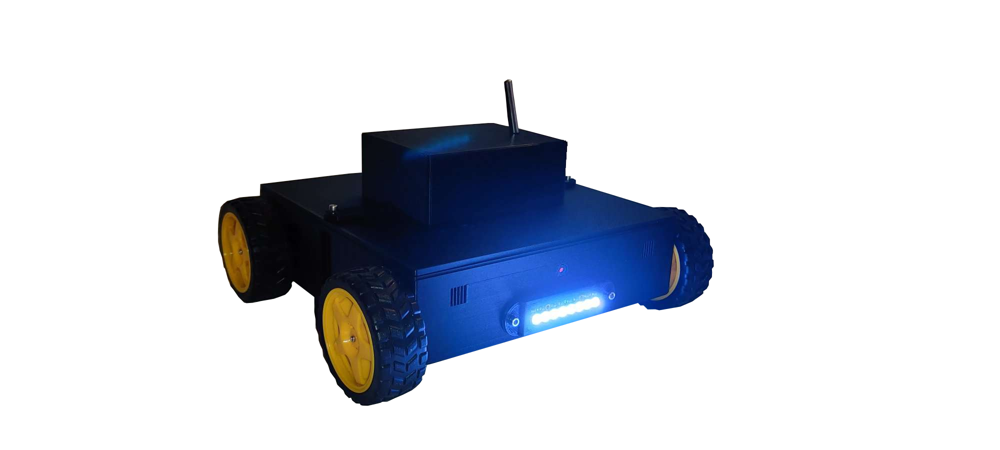

# Embedded Environment Analysis System

[](https://www.arduino.cc/)
[](https://opensource.org/licenses/MIT)

## Overview

This project is an **Autonomous Environmental Analysis Robot** designed to explore and monitor air quality in real-time. Built on an Arduino Mega platform, it integrates professional-grade sensors to measure atmospheric pressure, temperature, and multiple hazardous gases (CO, Smoke, CH4, Propane).

The system features a modular firmware architecture, separating motor control logic from sensor processing, making it highly maintainable and scalable.

---

## The System


*Figure 1: Mobile analysis platform equipped with gas sensors and NeoPixel status indicators.*

---

## Key Features

* **Multi-Gas Detection:** Real-time PPM calculation for CO, Smoke, Methane, and Propane using calibrated MQ-series sensors.
* **Precision Telemetry:** Integration of the DFRobot ICP10111 for high-accuracy barometric pressure monitoring.
* **Modular Drive System:** 4-motor DC drive controlled via Adafruit Motor Shield, supporting full omnidirectional movement.
* **Visual Feedback:** 8-pixel NeoPixel LED strip for status signaling and alerts.
* **Remote Command Interface:** Serial-based control protocol for movement and data triggering.

---

## Hardware Components

| Component | Description |
| :--- | :--- |
| **Microcontroller** | Arduino Mega 2560 |
| **Motor Driver** | Adafruit Motor Shield (L293D based) |
| **Pressure Sensor** | DFRobot ICP10111 |
| **Temp Sensor** | DS18B20 (OneWire) |
| **Gas Sensors** | MQ-2 (Smoke/LPG), MQ-7 (CO) |
| **Illumination** | Adafruit NeoPixel Stick (8 RGB LEDs) |

---

## Project Structure

```text
Embedded-environment-analysis-system/
├── Embedded-environment-analysis-system.ino  # Main entry point (Setup & Loop)
├── config.h                                  # Pin definitions & Calibration constants
├── motors.h / motors.cpp                     # DC Motor control logic
├── sensors.h / sensors.cpp                   # Sensor processing & LED management
└── README.md                                 # Project documentation
